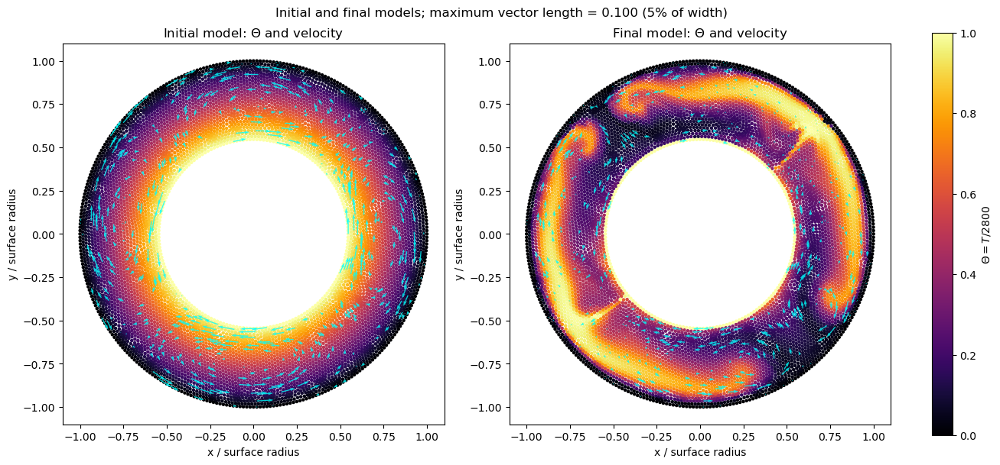
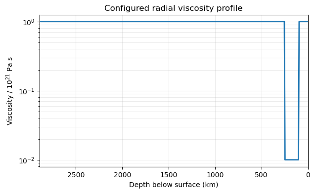

# Building and running an Underworld3 annulus model with ChatGPT

This guide records a reproducible example of using ChatGPT as a coding partner to build and run a small Underworld3 geodynamics model. The example is a 2-D annulus representing the mantle between the core–mantle boundary and the surface of the Earth.

The working files are:

- [`earth_annulus_convection.ipynb`](earth_annulus_convection.ipynb) — self-contained notebook that builds, runs, checks, and plots the model.
- [`test_annulus_convection.py`](test_annulus_convection.py) — command-line smoke/regression test.
- [`images/initial_final_models.png`](images/initial_final_models.png) — initial and final temperature fields with normalized velocity vectors.
- [`images/viscosity_profile.png`](images/viscosity_profile.png) — radial viscosity profile used by the run.

## 1. ChatGPT installs Underworld3

The first prompt gave ChatGPT the scientific target and asked it to identify any missing setup information and create the test model:

> Build underworld3 (underworldproject.org) and create a test script to test annulus convection of the Earth with convergent surface velocities and a temperature gradient from 0 to 2800 at the Core Mantle Boundary. Include a viscosity profile with 10x21 Pas at the surface, 10x19 in the asthenosphere and 10x21 in the lower mantle. Ask me any other questions you need to setup.

From this, ChatGPT translated the request into explicit model parameters:

| Quantity | Value in the example |
| --- | ---: |
| Surface radius | 6371 km |
| Core–mantle boundary radius | 3480 km |
| Surface temperature | 0 K |
| CMB temperature | 2800 K |
| Surface viscosity | 10^21 Pa s |
| Asthenosphere viscosity | 10^19 Pa s |
| Lower-mantle viscosity | 10^21 Pa s |
| Asthenosphere depth interval | 100–250 km |
| Lower-mantle transition | 660 km depth |

ChatGPT first cloned the official Underworld3 repository and entered its checkout:

```bash
git clone https://github.com/underworldcode/underworld3.git
cd underworld3
```

ChatGPT then ran the Underworld setup wizard. When the interactive choices appeared, it selected the runtime environment, no AMR, and the platform-default MPICH implementation:

```bash
./uw setup
```

ChatGPT built the environment and verified the installation:

```bash
./uw build
./uw doctor
```

At the end of Step 1, ChatGPT had installed and verified the Underworld3 runtime. Jupyter was installed in the next step.

## 2. ChatGPT installs Jupyter

The user then asked ChatGPT to create a notebook and make sure the notebook tooling was available:

> ok create a jupyter notebook (make sure notebooks are installed) that represents the run that you have just setup

ChatGPT installed the notebook interface into the Underworld3 runtime environment with:

```bash
pixi run -e runtime pip install notebook
```

The important point is that ChatGPT installed and launched Jupyter through the same `runtime` environment that contains Underworld3. Running a system Jupyter executable could otherwise select a different Python environment and fail to import `underworld3`.

## 3. ChatGPT builds the self-contained notebook

The user then refined the notebook implementation:

> incorporate the build_annulus_model into the jupyter notebook itself

> ok push this into a subdirectory called annulus_2D and make this a simulation that runs for several timesteps. There should be a surface velocity with 4 equal parts of diverging and converging velocities. 2 parts slow divergence (2 cm/yr each side) 2 parts fast divergence (6 cm/yr each way).

These prompts led to a notebook that is self-contained rather than importing the Python test file. That makes the notebook a compact record of the actual run: the parameter definitions, mesh, boundary conditions, solver setup, time loop, checks, and plots are all visible in one place.

The four surface sectors are generated from a tangential velocity proportional to `sin(2 theta)`. The amplitude is 2 cm/yr on the right-hand half of the annulus and 6 cm/yr on the left-hand half. This creates slow divergence at one horizontal end, fast divergence at the opposite end, and convergence at the two intervening ends.

The main modelling choice is that temperature and viscosity are normalized internally. The notebook reports the dimensional values in its setup cell and uses `Theta = T / 2800` and viscosity relative to `10^21 Pa s` for the solver.

## 4. Run the notebook

From the Underworld3 checkout, open the notebook interactively:

```bash
pixi run -e runtime jupyter notebook ../earth_annulus_convection.ipynb
```

For a repeatable, non-interactive execution that refreshes the stored outputs:

```bash
pixi run -e runtime jupyter nbconvert \
  --to notebook \
  --execute ../earth_annulus_convection.ipynb \
  --inplace \
  --ExecutePreprocessor.timeout=900
```

The notebook defaults to ten time steps on a deliberately coarse mesh. For a longer or more resolved calculation, change `steps` or `cell_size_km` in the run cell. The same model builder is also available as a script:

```bash
pixi run -e runtime python ../test_annulus_convection.py --steps 20
```

## 5. The final visualization request

The final prompt asked ChatGPT to expose the time evolution and make the vector plot readable:

> Show initial and final models and normalise the velocity vectors on the velocity field to be maximally 0.05 of the total (if the width is 1)

The notebook now stores the initial temperature and velocity fields before the time loop and the final fields after it. Both panels use the same color scale. The velocity arrows are rescaled so that the longest arrow is 5% of the plotted width; in a unit-width plot this is 0.05. Because this annulus uses radius 1 and spans from -1 to 1, the displayed cap is 0.10 coordinate units. This changes only the display length, not the velocity used by the solver.



The radial viscosity function has the requested three levels: `10^21 Pa s` near the surface, `10^19 Pa s` in the asthenosphere, and `10^21 Pa s` in the lower mantle.



## 6. Small samples of the generated output

The command-line smoke test reports the essential setup checks without printing the full solver trace:

```text
Earth annulus convection test: PASS
mesh vertices: 7186
steps / dt: 1 / 9.810e-03
T endpoints: 0 -> 2800 K
surface velocities: slow=2, fast=6 cm/yr
viscosity probes: [1.0, 0.01, 1.0] x 1e21 Pa s
Rayleigh number: 6.571e+07
final Theta range: [0.0000, 1.0000]
```

The ten-step notebook run records a larger mesh and the nondimensional coefficients used by the thermal solver:

```text
mesh_vertices: 7186
steps: 10
dt_nd: 0.009810076911002982
rayleigh: 65706223.76162737
kappa_nd: 0.0002728951919750951
buoyancy_coeff_nd: 17930.91254738786
eta_probe_nd: [1.0, 0.01, 1.0]
temperature_min_nd: 0.0
temperature_max_nd: 1.0
All requested setup checks passed.
```

These excerpts are intended as quick evidence that the model was built and executed. They do not replace convergence studies: for scientific use, increase the spatial resolution and timestep count, test timestep sensitivity, and compare results across mesh refinements.

## 7. What ChatGPT contributed

In this workflow ChatGPT acted as a collaborative modeller and software assistant. It:

1. converted the verbal Earth setup into explicit radii, temperatures, layer depths, viscosities, and nondimensional scales;
2. created the Underworld3 setup and test script;
3. installed and used the matching Jupyter runtime;
4. moved the reproducible example into `annulus_2D/`;
5. incorporated the model builder directly into the notebook;
6. added the four-sector surface velocity pattern and a multi-step run;
7. added checks, initial/final plots, and display-only vector normalization.

The resulting notebook is therefore both an executable experiment and a compact example of how a natural-language geodynamics request can be refined through short ChatGPT prompts into a testable Underworld3 model.
